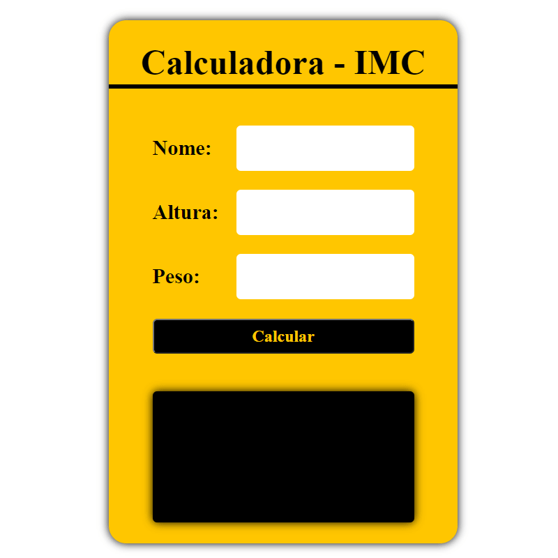

Projetos em JavaScript que eu como estudante do 1 periodo de ADS fiz!!!

<table border="2">
  <tr>
    <td>
        <h3> Calculadora IMC</h3>
        <li><a href="./00-imc/"></li>        
        
    </td>
      <td>
      <h3> Calculadora</h3>
      <li><a href="./06-Calculadora/"></li>     
      
    </td>    
    
  </tr>
  

  <tr>
    <td>
      <h3> To-do-list</h3>
      <li><a href="./07-todo-List/"></li>    
      
    </td>
    <td>
      <h3> CRUD</h3>
      <li><a href="./08-crud/"></li>
      
    </td>
  </tr>
  
</table>